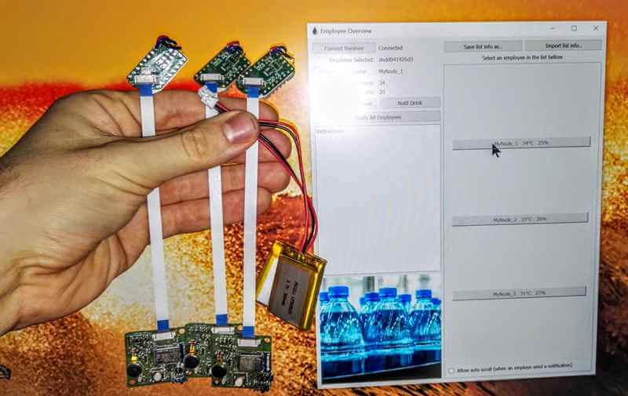
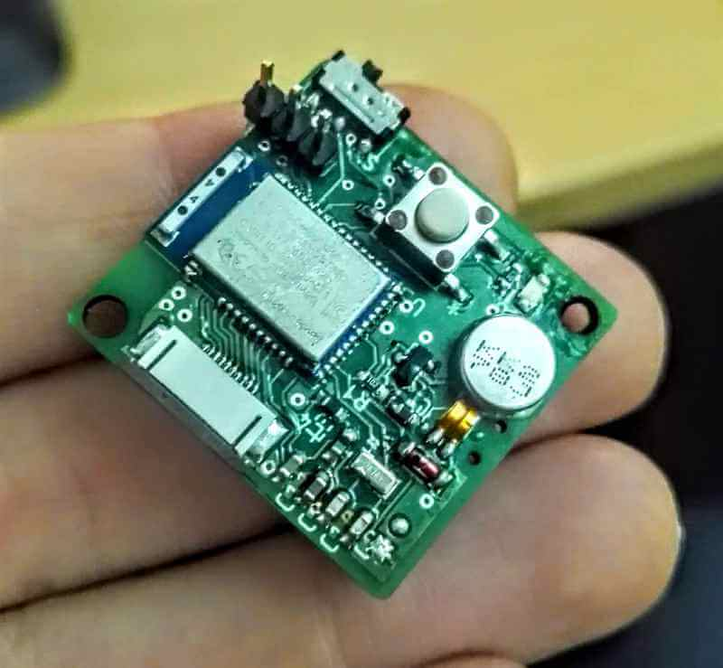
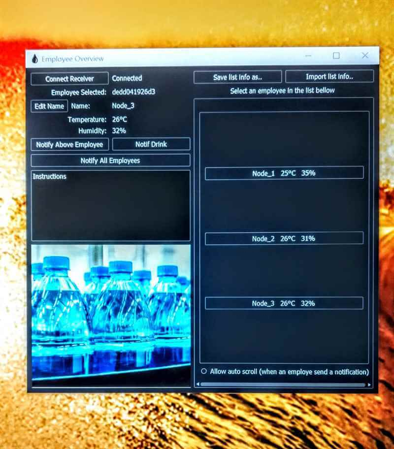

<h1 align="center">Dehydration Measurement System</h1>

# Quick Description

PCB, Embedded system firmware and complementary GUI to measure the vital signs of a group of individuals.
 
This project's code "Dehydration" is due to the final objective to analyze data and display a dehydration level of the user. 
 
(Machine Learning involved, from the data science department) 
 

# Details

This system enable us to measure different various physical values of a group of subjects and record/display them on desktop application. The values measured are skin temperature, surrounding humidity and surrounding temperature.
 

## Embedded System and PCB
The embedded system communicates with bluetooth LE to a base station connected to a computer. 
 
It uses the Nordic NRF SDK and acts as a beacon to transmit data at regular intervals.
 
The PCB has been made with Eagle and assembled on premises. 
  

 

## GUI
The GUI is designed with Qt, PyQt more especially. 
 
It will search through the USB port for a base station and start receiving data when connected.
 
Data is then stored and displayed. The Devices are appearing and disapearing dynamically along their connections status.
 
Not the most elaborate UI, but it did a fine job back then and validated our proof of concept.
  

# Note
This project is the first version/prototype as proof of concept which lead us to continue on a following project with a higher complexity and capabilities.

